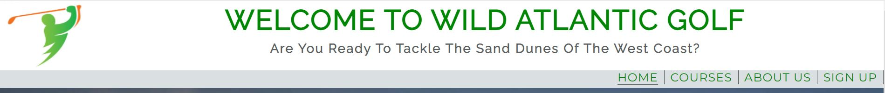

# Wild Atlantic Golf (will include link to official website)

## 1. **Introduction**

### **What**
Wild Atlantic Golf is an *Informative Website* purely built to **provide** information to it's users free of charge.
It is a golf related website built by a software developer who takes a great interest in this particular sport. He lives 
on the West coast of Ireland which means he is not new within the area and he knows what would interest its "potential
online visitors". The fact that he is surrounded by some world-class courses within a 40 km radius gave him the first 
'spark'. The website is filled with quality images showing off the landscape so overall, it will enhance the 
level of tourism for this part of Ireland. 

### **How**
The website first offers some reasons *why the user should stay on the site just under the main image with the hopes to
catch the user's eye by providing a list of reasons and surely, one may enough to convince the user with the main above it.
This section is followed by another "information section" if the user is convinced about the entire west coast of Ireland and 
what golf opportunities exist in this particular area along with ideas like hotels and restaurants if the user would want
to make a family holiday out of it. 
The second page is the main concept of the website where the **key information** is provided for the user. The golf courses are
briefly described with a large image on the side to enhance their imagination. 
The third page offers the user to type some personal information to receive news about updates to come which is a major plan 
for the developer in the future. 

### **Who**
The target audience is **world-wide**. There are over *65 million* golfers around the world so the target market is around this 
number. Most of these will more than likely have families so by providing information about *staying and dining* only increases 
the original target audience.

**New User**: The idea behind this website is to attract local and international golfers to the West Coast of Ireland. For first time users, the reason why they would land on this page is find out information regarding golf courses along the Wild Atlantic Way. Therefore, on the landing page, they would find key regarding the area and its accessibility. However, the main informative page is the course.html given that it provides images and a description of each course and this is why buttons linked to course.html are located all over the landing page. It is optional for each new user to sign up by entering their email address if they wish to return as exisiting users.

**Existing User**: There are over 40 links golf courses on the Western Region so the developer's future plan is to extend the site by adding more pages and four *new golf courses* to the *course.html* every month. By signing up, the new user will be notified after updates have taken place and they can return to the site with a matter of a click to check out the updates.

SCREENSHOT OF AM I RESPONSIVE

## 2. **Features (exisiting)**

There's a button or a clickable link provided withing every section of this website to enhance the level of interaction with the 
user. 

### 1. **Home Page**

#### *Header - Navigation Menu*
The **header** consists of the site's name and an "inspiring quote" to enhance the mood and inspire new visitors. There is a logo
to the left hand side with colours to match the overall theme of the website for better user visuality.

The **navigation menu** onsists of four main elements that the user can *choose* from if they would prefer to go straight to their "interest area".
The header is in a fixed position and it is displayed on all of the three pages in different styles suggesting that this feature follows the user at all times in order for them to have full control of their visit while maintaining consistency. 

#### *Main Image Area*
Large image right under the header to catch any visitor's eyes at the very start. This image was chosen because it demonstrates
what a golf course looks like along the Wild Atlantic and from a user perspective, it would catch any enthusiast golfer's eyes. 

It features a **"zoom-scale"** element to make it stand out visually for the first 5 seconds.

The *text area* within the image describes the whole *concept* of the website in a couple of lines and what kind of information it has got to offer. The text is specially written to **address the user**. In terms of feature, it comes with a **button** if the user wants to jump straight onto the informative web-page which provides information and images about the golf courses. This is done to maintain user interaction but at the same
time, the whole concept behind the website is to show off the golf courses.

#### *Reason's Section*

Consists of two parts: 

A *list of reasons to play golf on the West coast of Ireland* and two breath-taking images from a **golfer's point of view**.
The list consists of four main reasons in different categories to ensure that *international* users also feel included as well as 
*golf lover's with families*. It also targets the main concept by mentioning the large sand-dunes of the West Coast with an 
image to the side to back it up. 
Overall, it's aim and feature is to convince the user that this is **can't miss opportunity** and by signing up, they will get to 
know more about golf within this area. 

SCREENSHOT OF REASONS SECTION

#### *Wild Box Section*

The West of Ireland has a 2,500km long coast which is also known as the 'Wild Atlantic Way', hence, the name of the website is
**Wild Atlantic Golf**. 
This section consists of two parts: 
**Wild Video Box**
This part features an embedded, one minute YouTube video to show off the Wild Atlantic Coast. The user has full control of this 
video given that it is not on *auto-play* and will only play if the user decides to do so. The volume, mute is also under the user's control. 
**Wild Text Box**
Briefly offers reasons why user's **should** consider visiting and playing golf. Ireland is known for its tradional pubs which 
was included for better convincing. 
**Wild Header**
Features a link which means that if a user decides they want to know more about the Wild Atlantic Way, they can click on the heading which will take them to its official website in a *new tab*.

#### *About Area Section*

Consists of three sections: *About Us*, *Feeling Inspired?* *Join Us* aligned horizontally with the same style. The text is written in first person to maintain consistent interaction and kept short.  

**About Us**
A couple of lines about the editor/developer. It's feature is to acknowledge with each user that the editor is an expert and knows
what to include. 

**Feeling Inspired**
Heading is related to the *Reason's Section*. It's feature is to ensure if the user is not inspired yet, more interactive text
will guarantee their level of interest by mentioning a famous golf event which took place in Co. Clare back in 2019. 
This part also features a **button** which is linked with the *Courses* web-page given that the user is coming to the end of the 
page. 

**Join US**
This box tells the user what to expect if they wish to sign up to the website. Again, the text is addressed to the user like a 
*1v1* experience and a **button** is provided below the text as a feature which is linked with the *"Form Web-page"*.

SCREENSHOT OF ABOUT SECTION

#### *Footer section*

Features the top three social media icons in the middle. Each icon is linked to the correct social media official website
and in terms of accessibility, it is aria labelled and if the user hovers over, they know it works by the straight line below
each icon. 

### 2. **Course Web-page**

