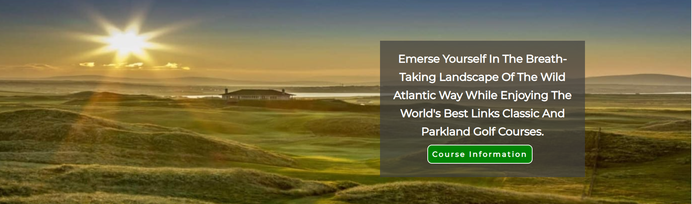
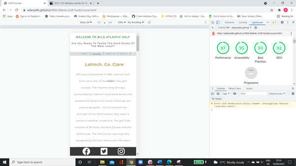

# Wild Atlantic Golf (will include link to official website)

## 1. **Introduction**

### **What**
Wild Atlantic Golf is an *Informative Website* purely built to **provide** information to it's users free of charge.
It is a golf related website built by a software developer who takes a great interest in this particular sport. He lives 
on the West coast of Ireland which means he is not new within the area and he knows what would interest its "potential
online visitors". The fact that he is surrounded by some world-class courses within a 40 km radius gave him the first 
'spark'. The website is filled with quality images showing off the landscape so overall, it will enhance the 
level of tourism for this part of Ireland. 

### **How**
The website first offers some reasons *why the user should stay on the site just under the main image with the hopes to
catch the user's eye by providing a list of reasons and surely, one may enough to convince the user with the main above it.
This section is followed by another "information section" if the user is convinced about the entire west coast of Ireland and 
what golf opportunities exist in this particular area along with ideas like hotels and restaurants if the user would want
to make a family holiday out of it. 
The second page is the main concept of the website where the **key information** is provided for the user. The golf courses are
briefly described with a large image on the side to enhance their imagination. 
The third page offers the user to type some personal information to receive news about updates to come which is a major plan 
for the developer in the future. 

### **Who**
The target audience is **world-wide**. There are over *65 million* golfers around the world so the target market is around this 
number. Most of these will more than likely have families so by providing information about *staying and dining* only increases 
the original target audience.

**New User**: The idea behind this website is to attract local and international golfers to the West Coast of Ireland. For first time users, the reason why they would land on this page is find out information regarding golf courses along the Wild Atlantic Way. Therefore, on the landing page, they would find key regarding the area and its accessibility. However, the main informative page is the course.html given that it provides images and a description of each course and this is why buttons linked to course.html are located all over the landing page. It is optional for each new user to sign up by entering their email address if they wish to return as exisiting users.

**Existing User**: There are over 40 links golf courses on the Western Region so the developer's future plan is to extend the site by adding more pages and four *new golf courses* to the *course.html* every month. By signing up, the new user will be notified after updates have taken place and they can return to the site with a matter of a click to check out the updates.

SCREENSHOT OF AM I RESPONSIVE

## 2. **Features (exisiting)**

There's a button or a clickable link provided withing every section of this website to enhance the level of interaction with the 
user. 

### 1. **Home Page**

#### *Header - Navigation Menu*
The **header** consists of the site's name and an "inspiring quote" to enhance the mood and inspire new visitors. There is a logo
to the left hand side with colours to match the overall theme of the website for better user visuality. From a personal point of view, website header are normally linked with home page, especially if they're fixed so for this reason, another feature of the heading is that if a user clicks on the heading as 'normal', it will direct them back to the top of the home page.

The **navigation menu** onsists of four main elements that the user can *choose* from if they would prefer to go straight to their "interest area".
The header is in a fixed position and it is displayed on all of the three pages in different styles suggesting that this feature follows the user at all times in order for them to have full control of their visit while maintaining consistency. 

#### **Main Image Area**
Large image right under the header to catch any visitor's eyes at the very start. This image was chosen because it demonstrates
what a golf course looks like along the Wild Atlantic and from a user perspective, it would catch any enthusiast golfer's eyes. 

It features a **"zoom-scale"** element to make it stand out visually for the first 5 seconds.

The *text area* within the image describes the whole *concept* of the website in a couple of lines and what kind of information it has got to offer. The text is specially written to **address the user**. In terms of feature, it comes with a **button** if the user wants to jump straight onto the informative web-page which provides information and images about the golf courses. This is done to maintain user interaction but at the same
time, the whole concept behind the website is to show off the golf courses.

#### **Reason's Section**

**Consists of two parts:** 

A *list of reasons to play golf on the West coast of Ireland* and two breath-taking images from a **golfer's point of view**.
The list consists of four main reasons in different categories to ensure that *international* users also feel included as well as 
*golf lover's with families*. It also targets the main concept by mentioning the large sand-dunes of the West Coast with an 
image to the side to back it up. 
Overall, it's aim and feature is to convince the user that this is **can't miss opportunity** and by signing up, they will get to 
know more about golf within this area. 

#### **Wild Box Section**

The West of Ireland has a 2,500km long coast which is also known as the 'Wild Atlantic Way', hence, the name of the website is
**Wild Atlantic Golf**. 

This section consists of two parts: 

**Wild Video Box**
This part features an embedded, one minute YouTube video to show off the Wild Atlantic Coast. The user has full control of this 
video given that it is not on *auto-play* and will only play if the user decides to do so. The volume, mute is also under the user's control. 

**Wild Text Box**
Briefly offers reasons why user's **should** consider visiting and playing golf. Ireland is known for its tradional pubs which 
was included for better convincing. 

**Wild Header**
Features a link which means that if a user decides they want to know more about the Wild Atlantic Way, they can click on the heading which will take them to its official website in a *new tab*.

#### **About Area Section**

Consists of three sections: *About Us*, *Feeling Inspired?* *Join Us* aligned horizontally with the same style. The text is written in first person to maintain consistent interaction and kept short.  

* **About Us**
A couple of lines about the editor/developer. It's feature is to acknowledge with each user that the editor is an expert and knows
what to include. 

* **Feeling Inspired**
Heading is related to the *Reason's Section*. It's feature is to ensure if the user is not inspired yet, more interactive text
will guarantee their level of interest by mentioning a famous golf event which took place in Co. Clare back in 2019. 
This part also features a **button** which is linked with the *Courses* web-page given that the user is coming to the end of the 
page. 

* **Join US**
This box tells the user what to expect if they wish to sign up to the website. Again, the text is addressed to the user like a 
*1v1* experience and a **button** is provided below the text as a feature which is linked with the *"Form Web-page"*.

SCREENSHOT OF ABOUT SECTION

#### **Footer section**

Features the top three social media icons in the middle. Each icon is linked to the correct social media official website
and in terms of accessibility, it is aria labelled and if the user hovers over, they know it works by the straight line below
each icon. 

### 2. **Course Web-page**
**About**
This page includes a list of golf courses, the main reason why most users find the website given the metatags provided for now. The *header and footer is positioned fixed* to maintain consistency and for now, four golf courses have been added with at least another 36 of the 40 links golf courses.

The current four courses demonstrate the overall layout for every second course and class attributes were created for all rather than each for this reason and to maintain overall structure and size. 

Famous golfer **quotes** have been added under each image and text to demonstrate how awarding each golf course is. The world-known golfer's opinion regarding each particular course will strengthen each user's inspiration of wanting to visit. In terms of style, the **colour of the text was changed** to match the heading and **maximum font-weight** to make them stand out. 

Each golf course has it own section and in terms of dividing them considering future updates, an hr element was styled and added to blend in but split each section up at the same time for the user. 

In terms of feature, **each course image is linked** to each particular golf club's home webpage and to demonstrate this to a new user, a one-line paragraph was added under each image as well as *aria-labelled* for better accessibility.

The images below demonstrate what the two styles look like one another and for the following 36 golf courses to come.

At the *bottom of the page*, just above the footer, there is a **button** linked with the top of the page for better user interaction and to prevent the user from having to scroll up once more golf courses are added in the future.

### 3. **Form Web-page**
This web-page again includes the header and footer identically to maintain consistency. The back-ground image is an image of a golf hole in the center in a *sunset setting* for a warm atmosphere while the user enters their details. The developer has minimal information on this website during this project but in the future, he wants to expand the course page while adding other pages so at that stage, it'll be worthwhile for the user to sign up.  

The form **heading-text** is a form interaction with the user to maintain their experience and convince them further to sign up incase they're hesitating. 

The form box contains three inputs, *full-name*, *Email* and *Confirm Email*. No password is required because only an email notification would be sent after an update has taken place. However, it is important that a correct email addrees has been entered not to miss out and for a database with correct information. Unfortunately, given the limitations of HTML and CSS, the developer could proceed further than the **submit** button without JavaScript so therefore, there is nothing waiting on the other side other than a warm welcome message.

There is a **clear** button also added along with submit incase the user wants to clear their text input for any reason. This maintains full user control as well as efficiency and save time for them.  

## Features (new ideas)

* To add the remaining 36 links golf courses, 4 every month using own images taken at each golf course once a week. This would followed by parkland golf courses, a little less popular but still beautiful possibly in another page so overall, have one page for **Links Courses** and **Parkland Courses**. 

* Create more webpages and increase the nav menu with it. For this kind of informative website. 
    * A separate page for is imagined for recommendational golfing routes using google maps and including recommnded hotels and restaurants. 
    * A **sight-seeing** page where recommended tourist attractions are listed and styled. For example, the *Cliffs of Moher*, the *Burren* etc. 
    * Expand each course section to include a **direct link** to book tee times for each golf course and possibly a map to show it's location. 

* Improve the layout of the home page by possibly increasing the size of the main image to fill the screen with a lower image size to load faster for the users with slower connections. 

* Create own logo for the website which will also be displayed within the footer. For the current project, a free logo was used but came with a back-ground of white which would not have been visually good at the bottom but fits in with the white background of the heading area. 

* Expand the *Reasons* section and style it with elements not yet discovered. 

* Within the "About Us section, include a short, personal profile with an image of the developer. 

* Add more inputs to the form page once the page is up and running with at least 12 golf courses such as:
    * **Age** (for marketing and statistical reasons) so therefore, it will be optional and a list will exist for each groups. For example, 20-25 etc. 
    * **Nationality** for the same purpose ass age. 

## 3. Testing and Bugs Fixed/Unfixed

### **Validator Testing**

The Wild Atlantic Golf website has gone through validation at the end of the project.

Each page has been validated within the website using the **Deployed** version and **Page source code**

#### **Index.html validation**

One warning has risen as seen. However, the #main-image-section only consists of a large as a background image and a short paragraph within the text box area. As a result, there was no need to put a heading within the section and its part of the home page so it does not need to be identified.

#### **Course.html validation**

No errors or warnings for this web-page. 

#### **Form.html validation**

No errors or warnings for this web-page. 

#### **Jigsaw-CSS validator**

The CSS source code was copied from the updated *GitHub repository* of this project and pasted through the validator. 

No issues were found. 

### **Devtools Lighthouse Testing**

Using the deployed version, each page undertook the lighthouse test and a report was generated for each. 

Fortunately, all pages scored high in all areas.

#### **Index.html Lighthouse Report**

#### **Course.html Lighthouse Report**

#### **Form.html Lighthouse Report**

### **Other types of testing**

To ensure that colour contrast scores high, **WebAIM Contrast Checker** was used to enhance the process of chosing approriate theme colours for headings, paragraphs and others text against their background

 [WebAIM Contrast Checker](https://webaim.org/resources/contrastchecker/ "Colour contrast checker").

### **Search Engine Testing**

The website has been tested on three search engines in total. Internet Explorer has been left out given that it is no longer considered as a popular browser and it is coming to the end of its overall functual expectancy. 

1. **Google Chrome (default)**

2. **Mozilla Firefox**

Each web-page was tested through *Mozilla Firefox* and no issues detected.

**index.html**

**course.html**

**form.html**

3. **Microsoft Edge**

Each web-page was tested through *Microsoft Edge* and no issues detected.

**index.html**

**course.html**

**form.html**

### **Website Features Test**

Every interactive link and video is checked for each page and marked complete below if it is working with no issues. 

**1. index.html Features**

* **Heading link** to home page - not set for home page as it is current. 

* **Navigation Menu Bar and Links (internal)**
     * **Home** (current) - Refreshes page so link test is complete.    
     * **Courses** - Link opens course.html and working perfectly.
     * **About us** - Link skips to #about-area and working perfectly.
     * **Sign Up** - Link opens form.html and working perfectly.

* **Course Information button** - Link opens course.html and working perfectly.

* **Wild Atlantic Way heading** - External link works fine when opened (opens in a new tab).

* **Wild Atlantic section video** - By default, it is paused and user has full control over all setting when pressing play. Video link is work perfectly.

* **About us buttons (internal)**

     * **Courses button** - Link opens course.html and working perfectly.

     * **Sign Up button** - Link opens form.html and working perfectly.

* **Footer (external links)**
     * **Facebook Icon** - External link opens Facebook's official website and working perfectly (opens in a new tab).

     * **Twitter Icon** - External link opensTwitter's official website and working perfectly (opens in a new tab).

     * **Instagram Icon** - External link opens Instagram's official website and working perfectly (opens in a new tab).

**2. course.html Features**

* **Heading link** - h1 and h2 internal link to index.html works perfectly. 

* **Navigation Menu Bar and Links (internal)**
     * **Home** - Link goes to index.html and works perfectly.     
     * **Courses** (current) - Refreshes page so link test is complete.
     * **About us** - Link skips to #about-area and working perfectly.
     * **Sign Up** - Link opens form.html and working perfectly.

* **Lahinch Image** - External link to Lahinch golf clubs website works perfectly (opens in a new tab).

* **Doonbeg Image** - External link to Trump Doonbeg golf clubs website works perfectly (opens in a new tab).

* **Ballybunion Image** - External link to Ballybunion golf clubs website works perfectly (opens in a new tab).

* **Waterville Image** - External link to Waterville golf clubs website works perfectly (opens in a new tab).

* **Back to the Top Button** - Internal link back to the top of the page works perfectly.

* **Footer (external links)**

* **Facebook Icon** - External link opens Facebook's official website and working perfectly (opens in a new tab).

* **Twitter Icon** - External link opensTwitter's official website and working perfectly (opens in a new tab).

* **Instagram Icon** - External link opens Instagram's official website and working perfectly (opens in a new tab).

**3. form.html Features**

* **Heading link** - h1 and h2 internal link to index.html works perfectly. 

* **Navigation Menu Bar and Links (internal)**
     * **Home** - Link opens index.html and working perfectly.    
     * **Courses** - Link opens course.html and working perfectly.
     * **About us** - Link goes to index.html#about-area and so working perfectly.
     * **Sign Up (current)** - Refreshes page so link test is complete. 

* **Form box**

* **Full name input** - Cannot skip unless something is entered.

* **Email Address** - Cannot skip unless email including **@** is entered. 

* **Confirm Email** - Cannot skip unless email including **@** is entered. (this input cannot verify if it matches the above input but this is due to the limitation of the project - HTML, CSS).

* **Sign Up Button** - External submit link opens page but no function due to limitations, only a message. 

* **Clear Button** - Reloads the page and clears input areas. 

* **Footer (external links)**

Footer is **fixed** and **identical** to other two pages

* **Facebook Icon** - External link opens Facebook's official website and working perfectly (opens in a new tab).

* **Twitter Icon** - External link opensTwitter's official website and working perfectly (opens in a new tab).

* **Instagram Icon** - External link opens Instagram's official website and working perfectly (opens in a new tab).

### **Screen Responsive Testing**

For this website, the [Am I Responsive](http://ami.responsivedesign.is/#) was used to test what happens at different screen sizes.

#### **index.html**
1.

2.

#### **course.html**
1.

2.

#### **form.html**

#### **Other ways of testing responsiveness**

A household member of the developer was asked to view the website on their mobile and see if any problems arose. 

## 4. Deployment

In order to start and be able to deploy this project, the developer needed to create a GitHub account and link it with his newly created GitPod account. 

The steps he needed to take to deploy this project to the public are:

1. Go to the *main menu* of GitHub's official website.

2. In the top right-hand corner, click on the **small arrow** above the icon. 

3. Click on **Your Repositories**.

4. Select the **project** wanting to deploy.

5. Above the *GitPod button*, click on **Settings**.

6. Scroll almost to bottom of the page to the *GitHub Pages* section.

7. From the *source section*, select **main branch**.

8. Click **Save**.

9. Update the page and the **live url** will be available and green when the site is public. 

## 5. Credits

